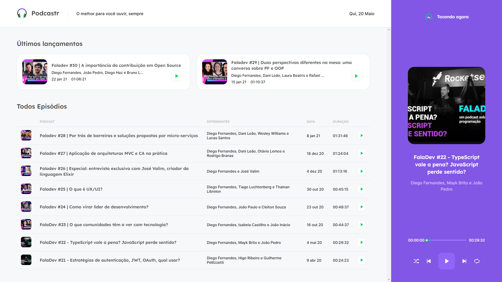

<div align="center">
  
</div>

## Podcastr

[](https://github.com/josepholiveira)
[](#)
[](https://github.com/josepholiveira/podcastr/stargazers)

<h4 align="center">
  Podcastr is a platform built for podcast broadcasting.
</h4>



## Tecnologies

<div align="center">
  <br />
  
</div>

This project was developed using cutting edge front-end technologies.


- [ReactJS](https://reactjs.org/)
- [Typescript](https://www.typescriptlang.org/)
- [Next.js](https://nextjs.org/)

## 💻 Getting started

### Requirements

- You need to install both [Node.js](https://nodejs.org/en/download/) and [Yarn](https://yarnpkg.com/) to run this project.

**Clone the project and access the folder**

```bash
$ git clone https://github.com/Renan-Olovics/NLW5-React-Podcaster.git && cd podcastrn
```

**Follow the steps below**

```bash
# Install the dependencies
$ yarn

# Run the backend fake server
$ yarn server

# Run the web dev server
$ yarn dev

# You can also change dev for a real website like:
# Build the server
$ yarn build 

#Now start the website
$ yarn start
```

The app will be available for access on your browser at `http://localhost:3000`
If you wanna check the "fake api" IT will be available for access on your browser at `http://localhost:3333/episodes`

## 📝 License

This project is licensed under the MIT License - see the [LICENSE](LICENSE) file for details.

---

Original Made with 💜 by Joseph Oliveira 👋 [Check out my LinkedIn](https://www.linkedin.com/in/joseph-oliveira-294a19165)

This project was built by [Renan Olovics](https://www.linkedin.com/in/recri) on  [RocketSeat](https://rocketseat.com.br/)  RocketSeat Next-level-week #05 Trilha de React

---


## I've learned from the project:

<p>API: {</p>
<p>Method Fetch;</p>
<p>Method get/post/put/delete/patch from Axios;</p>
}

<p>Date-fns for date configuration;</p>
<p>ContextAPI;</p>

## Double checked:

<p>React;</p>
<p>Next;</p>
<p>Sass;</p>
<p>typing in typescript;</p>
<p>Eslint;</p>
<p>Prettier;</p>
<p>stylelint;</p>
